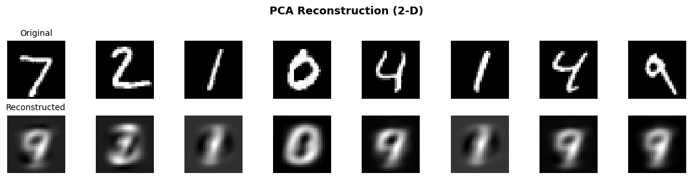
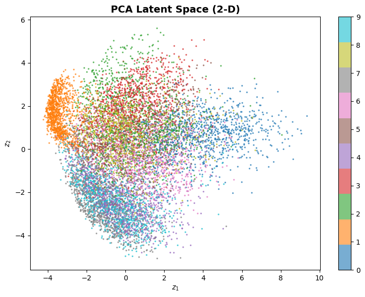
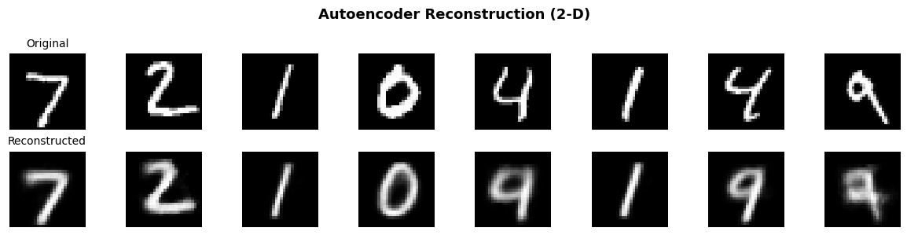
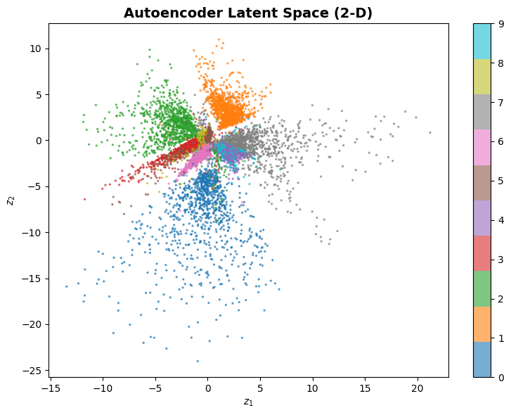
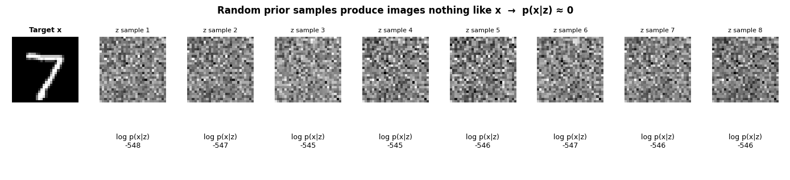
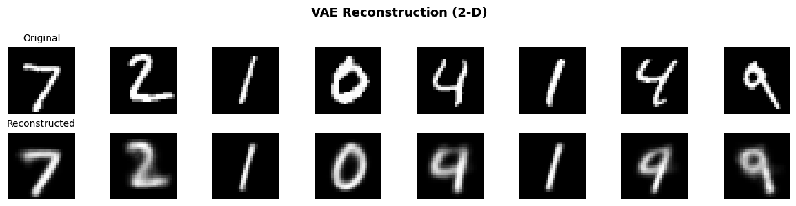
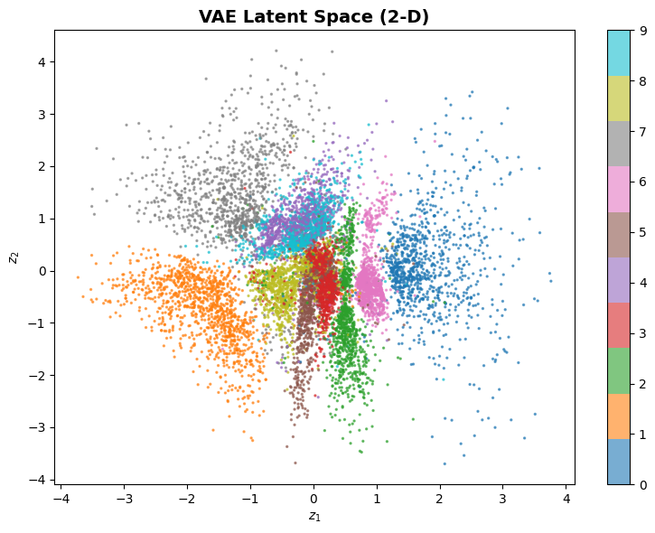
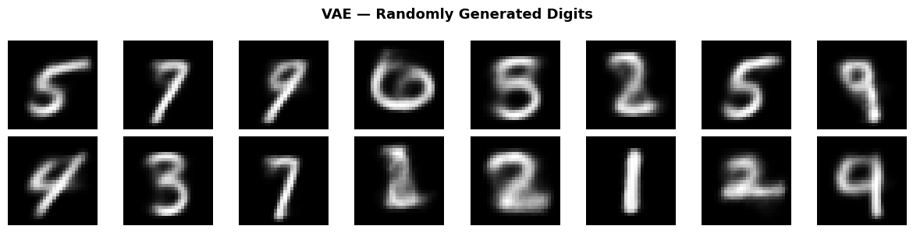
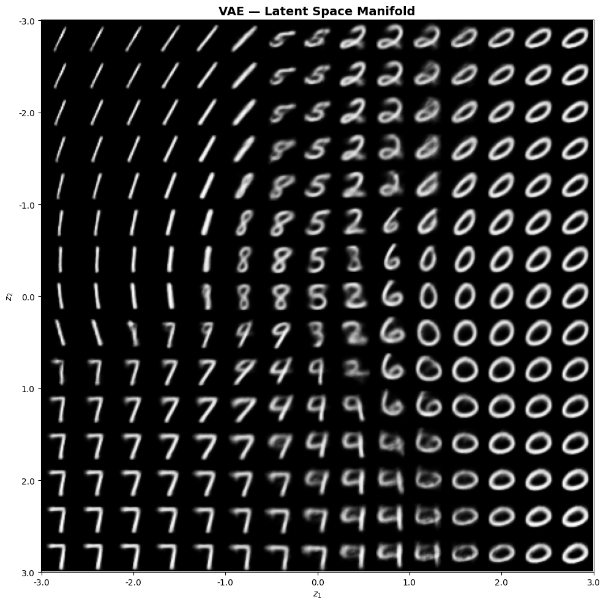
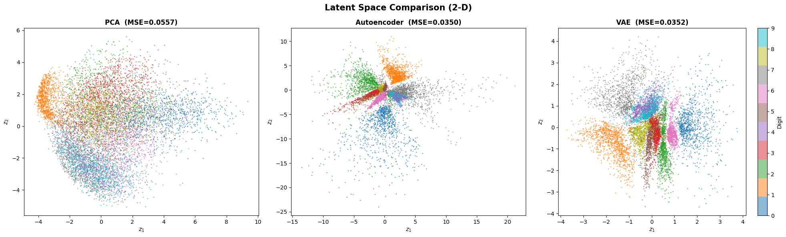

# From PCA to VAE — Understanding Dimensionality Reduction

I built this notebook to understand how we go from a simple idea — "project data onto a few important directions" — all the way to generating brand-new images from noise.

Everything is in one file, runs on MNIST, and uses a 2-D latent space so you can actually *see* what each method is doing.

[](https://colab.research.google.com/github/gaurav-redhat/From-PCA-to-VAE/blob/main/dimensionality_reduction.ipynb)

---

## 1. PCA — Principal Component Analysis

The oldest trick in the book. Given high-dimensional data, find the directions of maximum variance and project onto them.

```
         PCA
  x ──────────── z ──────────── x̂
 (784-D)  V_k^T  (2-D)  V_k   (784-D)
         encode         decode
```

Mathematically, given centred data matrix **X**:

- Compute SVD: **X = UΣV^T**
- Keep top-k right singular vectors: **V_k**
- Encode: **z = x · V_k**
- Decode: **x̂ = z · V_k^T**

It's a single matrix multiply in each direction — linear, closed-form, no training loop. The Eckart–Young theorem guarantees this is the best rank-k approximation under MSE.

The catch? Real-world data (like images) has nonlinear structure that a linear projection can't capture. Two principal components can separate some digits, but the reconstructions are blurry and the clusters overlap.

<p align="center">
  
</p>

<p align="center">
  
</p>

---

## 2. Autoencoder

Same compress-then-reconstruct idea, but now with neural networks so the mapping can be nonlinear.

```
         Encoder                    Decoder
  x ───[784→512→256→128→2]───z───[2→128→256→512→784]──── x̂
 (784-D)    f_ϕ(x)          (2-D)      g_θ(z)         (784-D)
```

We train by minimising reconstruction error:

**L = ||x - g_θ(f_ϕ(x))||²**

The nonlinearity lets it learn curved manifolds that PCA misses entirely. Reconstructions are sharper and the latent space clusters digits more cleanly.

But there's a problem: the latent space has no structure. Points are scattered wherever the network finds convenient. If you sample a random z and decode it, you'll likely land in a "dead zone" between clusters and get garbage. This isn't a generative model — it's just a compressor.

> Fun fact: a linear autoencoder (no activations) with MSE loss learns the exact same subspace as PCA.

<p align="center">
  
</p>

<p align="center">
  
</p>

---

## 3. VAE — Variational Autoencoder

This is the main event. The VAE is a proper generative model, but understanding *why* it's designed the way it is matters more than memorising the loss function.

### The setup: a generative story

We imagine each image was generated by a two-step process:

```
  Step 1: Sample latent code     z ~ N(0, I)
  Step 2: Generate image         x ~ p_θ(x|z)    ← neural network decoder
```

The joint probability is easy to write down:

**p_θ(x, z) = p_θ(x|z) · p(z)**

### The goal: maximise the marginal likelihood

To train this model, we want to maximise:

**p_θ(x) = ∫ p_θ(x|z) · p(z) dz**

This integral sums over every possible z. Sounds fine in theory.

### The problem: this integral is intractable

In practice, almost every z you sample from the prior produces an image nothing like the target x. So:

```
  z₁ ~ N(0,I)  → decode → 🔲  → p(x|z₁) ≈ 0
  z₂ ~ N(0,I)  → decode → 🔲  → p(x|z₂) ≈ 0
  z₃ ~ N(0,I)  → decode → 🔲  → p(x|z₃) ≈ 0
   ...
  z_K ~ N(0,I)  → decode → 🔲  → p(x|z_K) ≈ 0

  Monte Carlo estimate: p(x) ≈ (1/K) Σ p(x|z_k) ≈ 0   ← useless
```

The notebook actually runs this experiment — you can see the numbers. Even with 10,000 samples, the estimate is dominated by noise because no random z is "close enough" to the right one for a given x.

<p align="center">
  
</p>

We can't compute p(x), so we can't compute the posterior p(z|x) = p(x|z)p(z)/p(x) either. We're stuck.

### The fix: ELBO

Instead of searching blindly, **learn an encoder** q_ϕ(z|x) that, given an image x, proposes z values that are actually useful for reconstructing it.

```
                    ┌──── μ
  x ──[Encoder]──┤              z = μ + σ ⊙ ε      ε ~ N(0,I)
                    └──── log σ²
                                    │
                              [Decoder]
                                    │
                                    x̂
```

We can derive a lower bound on log p(x) — the **Evidence Lower Bound (ELBO)**:

```
  log p(x) ≥ E_q[log p(x|z)]  -  KL(q(z|x) || p(z))
              ─────────────       ─────────────────────
              Reconstruction       Regularisation
              "decode well"        "stay close to N(0,I)"
```

**Derivation sketch:**

```
  log p(x) = log ∫ p(x,z) dz
           = log ∫ [p(x,z)/q(z|x)] · q(z|x) dz
           ≥ ∫ q(z|x) · log[p(x,z)/q(z|x)] dz        ← Jensen's inequality
           = E_q[log p(x|z)] - KL(q(z|x) || p(z))     ← split the log
```

The gap between log p(x) and the ELBO is exactly KL(q || p(z|x)) ≥ 0. As we tighten the bound, both the generative model and the encoder improve.

### Why this works (vs naive sampling)

| Naive Monte Carlo | ELBO |
|---|---|
| Samples z blindly from N(0,I) | Encoder proposes z tailored to each x |
| Almost all z give p(x\|z) ≈ 0 | Encoder learns z that reconstructs x well |
| Estimate has infinite variance | Reparameterisation gives low-variance gradients |

### Reparameterisation trick

The encoder outputs μ and log σ². To backpropagate through sampling:

**z = μ + σ ⊙ ε,  where ε ~ N(0, I)**

The randomness is in ε (independent of the encoder parameters), so z is a differentiable function of ϕ.

### KL divergence (closed form)

For diagonal Gaussian q vs standard Gaussian prior:

**KL = -½ Σ (1 + log σ² - μ² - σ²)**

### After training

Because the KL term pushes the latent space toward N(0,I), we can generate new images by just sampling:

```
  z ~ N(0, I)  →  Decoder  →  new image
```

The latent space is smooth — nearby z values produce similar images, and sweeping through z shows digits morphing into each other.

<p align="center">
  
</p>

<p align="center">
  
</p>

<p align="center">
  
</p>

<p align="center">
  
</p>

---

## 4. The big picture

```
  Method          Encoder          Latent         Decoder         Can generate?
  ─────────────   ──────────────   ────────────   ──────────────  ─────────────
  PCA             Linear (V_k^T)   Orthogonal     Linear (V_k)    No
  Autoencoder     Neural net       Unstructured   Neural net       Not really
  VAE             Neural net → μ,σ Gaussian       Neural net       Yes
```

All three are doing the same thing at a high level: squeeze data through a bottleneck and try to reconstruct it. The difference is what happens in that bottleneck:

- **PCA** — rigid linear axes, globally optimal for MSE but can't bend
- **Autoencoder** — flexible but chaotic, good for compression, bad for generation
- **VAE** — flexible *and* structured, the KL term is the price we pay for a latent space we can actually sample from

<p align="center">
  
</p>
